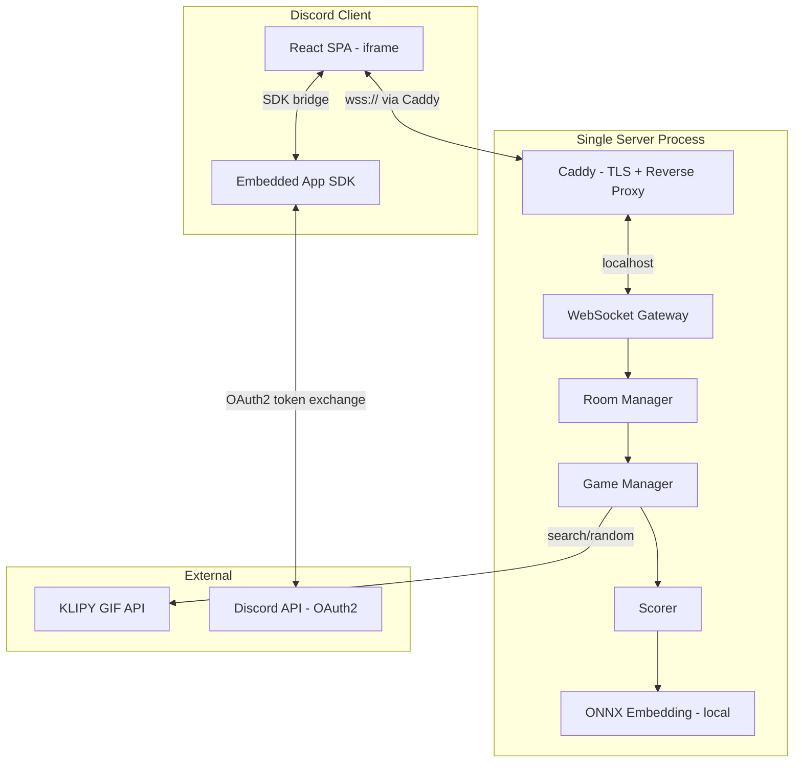
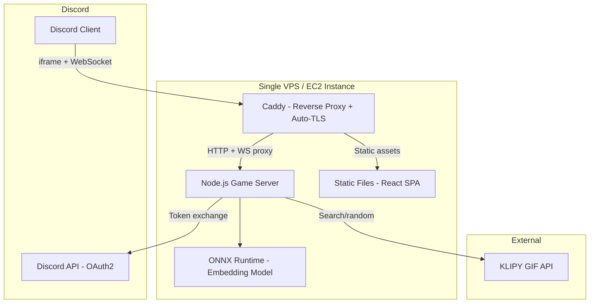
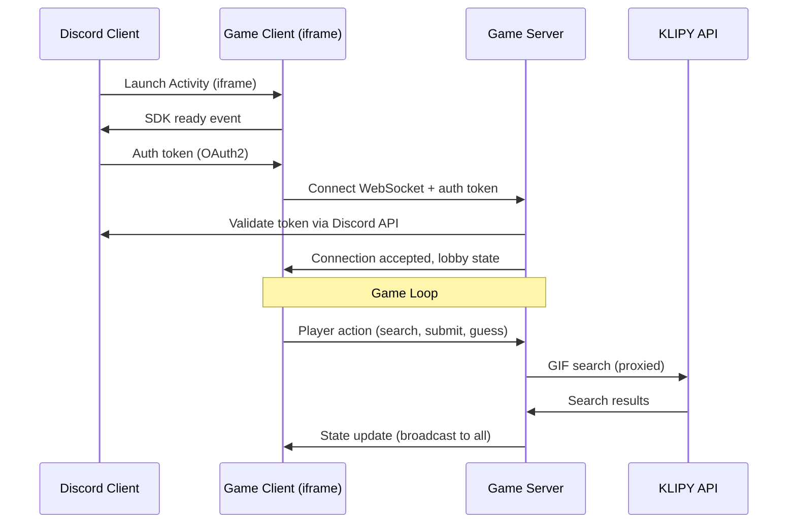
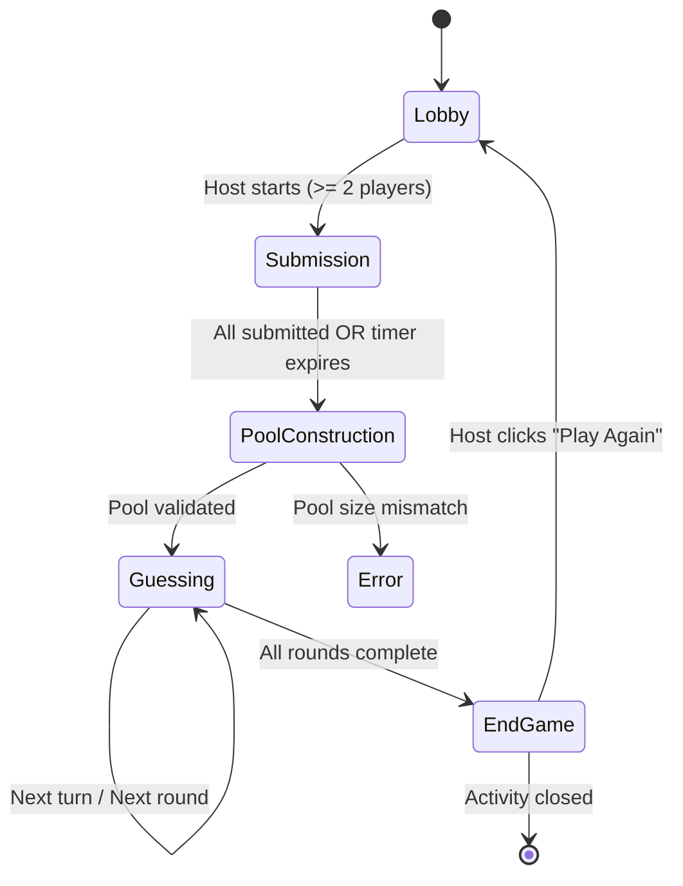

# Design Document: GIF Guessing Game

## Overview

A multiplayer GIF guessing game built as a Discord Activity using the Embedded App SDK. The application runs inside an iframe within Discord (voice channels, text channels, or DMs) and uses a WebSocket-based client-server architecture for real-time multiplayer synchronization. Players submit GIFs from KLIPY to a mystery pool, then take turns guessing who submitted each GIF and what its original title was.

The system follows a server-authoritative model where all game logic (scoring, phase transitions, timer management, pool construction) executes on the server. Clients are thin rendering layers that receive state updates and emit player actions.

### Key Design Decisions

1. **Server-authoritative state**: Prevents cheating and ensures all players see consistent state. The server owns timers, scoring, and phase transitions.
2. **WebSocket for real-time sync**: Low-latency bidirectional communication for game state updates, player actions, and connection management.
3. **KLIPY as sole GIF provider**: No fallback provider. Graceful degradation with retry and error messaging if KLIPY is unavailable.
4. **Text embeddings for semantic scoring**: Server-side embedding computation using a lightweight model (all-MiniLM-L6-v2 or similar) to compare guess vs. GIF title semantically.
5. **Centralized constants**: All magic numbers live in a single constants file for easy tuning without code changes.
6. **Colyseus-style room pattern**: Each game session is a "room" on the server, managing its own lifecycle and player connections.

## Architecture



### Deployment Topology

- **Client**: Static React SPA served from the same host (or optionally S3 + CloudFront), loaded inside Discord iframe via URL mapping
- **Server**: Single Node.js/TypeScript process handling WebSocket connections, game logic, KLIPY API calls, and local ONNX embedding inference
- **No database**: Game state is ephemeral (in-memory per room). No persistence needed since games are short-lived sessions.
- **No Redis**: Single-process architecture eliminates the need for external coordination. All room routing is in-memory.

## Infrastructure

### Design Philosophy

Minimize cost while preserving full functionality. The game's characteristics (short-lived sessions, small rooms of 2-8 players, ephemeral state) mean a single server process can handle significant load before needing horizontal scaling. Complexity is added only when real capacity limits are hit.

### Production Architecture



### Hosting Options (by cost)

| Option | Spec | Cost/month | Notes |
|--------|------|-----------|-------|
| AWS EC2 t4g.small (ARM) | 2 vCPU, 2GB RAM | $7-12 | Free tier year 1; reserved pricing available |
| AWS Lightsail | 1 vCPU, 1GB RAM | $5 | Includes static IP + 2TB transfer |
| Fly.io | Shared 1x 256MB | $3-5 | Free tier (3 shared VMs); handles TLS/deploys |
| Railway | Usage-based | $5 base | Zero-config deploys from Git |

**Recommended for MVP**: EC2 t4g.small or Fly.io. Both handle the load comfortably, with Fly.io offering simpler deploys and EC2 offering more control.

### Capacity Estimates (Single Process)

A single Node.js process can comfortably handle:
- ~5,000-10,000 concurrent WebSocket connections
- ~1,000-2,000 simultaneous game rooms
- ~4,000-16,000 concurrent players
- Embedding inference: ~5ms per scoring evaluation (all-MiniLM-L6-v2 via ONNX, ~80MB RAM)

### Reverse Proxy: Caddy

Caddy handles TLS termination (auto-provisioned via Let's Encrypt), WebSocket upgrades, and static file serving. No ALB or managed load balancer needed.

```
# Caddyfile (simplified)
gifsguess.example.com {
    handle /ws/* {
        reverse_proxy localhost:3001
    }
    handle /api/* {
        reverse_proxy localhost:3001
    }
    handle {
        root * /srv/client/dist
        file_server
        try_files {path} /index.html
    }
}
```

### Semantic Scoring: Local ONNX Model

The text embedding model runs locally on the server using `onnxruntime-node`, eliminating external API costs and latency:

- **Model**: all-MiniLM-L6-v2 (384-dim embeddings)
- **Size**: ~80MB on disk, ~100MB RAM at runtime
- **Latency**: ~5ms per embedding computation
- **Cost**: $0 (no external API calls)
- **Fallback**: If ONNX inference fails, semantic scoring returns 0 points (keyword-only scoring still works)

### Cost Breakdown

| Component | Monthly Cost |
|-----------|-------------|
| EC2 t4g.small (or equivalent VPS) | $5-12 |
| Domain registration (amortized) | ~$1 |
| TLS via Caddy (Let's Encrypt) | $0 |
| KLIPY API | Free tier / usage |
| ONNX model inference | $0 (local) |
| S3 (optional, for static assets) | ~$0.50 |
| **Total** | **$7-15/month** |

### What's Eliminated vs. Full-Scale

| Full-scale component | Replaced with | Savings |
|---------------------|--------------|---------|
| Redis (room routing) | In-memory Map | ~$12/month |
| ALB (load balancer) | Caddy (free) | ~$16/month |
| ECS Fargate (containers) | Single EC2/VPS | ~$15-30/month |
| External embedding API | Local ONNX | ~$5-50/month |
| CloudFront CDN | Caddy file_server | ~$0-5/month |

### Scaling Triggers (When to Add Complexity)

| Trigger | What to Add | Approx. Threshold |
|---------|------------|-------------------|
| >5K concurrent WebSocket connections | Second process + Redis for room routing | ~1,000+ simultaneous games |
| Need zero-downtime deploys | Move to ECS Fargate (2 tasks, rolling deploy) | When uptime SLA matters |
| Multi-region latency requirements | ALB + multiple instances + Redis pub/sub | Global player base |
| >50ms embedding latency under load | Dedicated GPU instance or external API | Unlikely at this model size |

### Deployment Strategy

- **CI/CD**: GitHub Actions (or equivalent) builds Docker image, pushes to ECR, SSHs to instance and pulls latest
- **Zero-downtime (cheap)**: pm2 with graceful reload (existing connections drain, new connections go to new process)
- **Rollback**: Keep last 3 Docker images tagged; rollback is a single `docker pull` + restart
- **Monitoring**: CloudWatch basic metrics (free tier) + structured logs to stdout (Caddy captures)

### Communication Flow



## Components and Interfaces

### Client Components

| Component | Responsibility |
|-----------|---------------|
| `DiscordSDKProvider` | Initializes Embedded App SDK, handles OAuth2 flow, exposes user identity |
| `WebSocketProvider` | Manages WebSocket connection lifecycle, reconnection, message dispatch |
| `GameStateProvider` | Holds client-side game state mirror, applies server patches |
| `LobbyView` | Renders player list, config panel (host), start button |
| `SubmissionView` | GIF search interface, selection grid, progress indicator, timer |
| `GuessingView` | GIF reveal, submitter guess selector, title input, spectator view |
| `ScoreboardView` | Live scoreboard, end-game results, animations |
| `AnimationEngine` | Spring-based animation system (framer-motion), respects prefers-reduced-motion |

### Server Components

| Component | Responsibility |
|-----------|---------------|
| `WebSocketGateway` | Accepts connections, authenticates via Discord token exchange, routes messages |
| `RoomManager` | Creates/destroys game rooms, maps instance IDs to rooms |
| `GameRoom` | State machine for a single game session (lobby, submission, guessing, end) |
| `PlayerManager` | Tracks connected players, handles disconnect/reconnect, host promotion |
| `TimerService` | Manages countdown timers, triggers auto-submit on expiry |
| `KlipyService` | Proxies KLIPY API calls (search, random), caches results briefly |
| `Scorer` | Evaluates title guesses (exact keyword match + semantic similarity) |
| `EmbeddingService` | Computes text embeddings for semantic scoring |
| `MysteryPoolBuilder` | Shuffles and constructs the anonymous GIF pool |

### WebSocket Message Protocol

Messages are JSON-encoded with a discriminated `type` field:

```typescript
// Client -> Server
type ClientMessage =
  | { type: 'join'; token: string; instanceId: string }
  | { type: 'config:update'; key: string; value: number }
  | { type: 'game:start' }
  | { type: 'gif:search'; query: string }
  | { type: 'gif:select'; gifId: string; gifUrl: string; title: string }
  | { type: 'gif:deselect'; gifId: string }
  | { type: 'guess:submitter'; playerId: string }
  | { type: 'guess:title'; text: string }

// Server -> Client  
type ServerMessage =
  | { type: 'state:full'; state: GameState }
  | { type: 'state:patch'; patch: Partial<GameState> }
  | { type: 'search:results'; gifs: GifResult[] }
  | { type: 'error'; code: string; message: string }
  | { type: 'player:joined'; player: PlayerInfo }
  | { type: 'player:left'; playerId: string }
  | { type: 'player:host-changed'; newHostId: string }
  | { type: 'timer:tick'; phase: string; remainingMs: number }
  | { type: 'score:reveal'; breakdown: ScoreBreakdown }
```

### Game State Machine



### External Interfaces

#### KLIPY API Integration

Based on KLIPY's GIF API ([klipy.com/api-overview](https://klipy.com/api-overview)):

```typescript
interface KlipyService {
  search(query: string, limit?: number): Promise<KlipyGif[]>;
  random(count: number): Promise<KlipyGif[]>;
}

interface KlipyGif {
  id: string;
  title: string;           // GIF_Title metadata
  url: string;             // Full-size GIF URL
  thumbnailUrl: string;    // Preview thumbnail
  width: number;
  height: number;
}
```

- Base URL: `https://api.klipy.com`
- Authentication: API key in header
- Search endpoint: `GET /v1/gifs/search?q={query}&limit={limit}`
- Random endpoint: `GET /v1/gifs/random?count={count}`
- Timeout: 3 seconds (per requirement 3.3)
- Results capped at 25 per search (per requirement 3.2)

#### Discord Embedded App SDK

```typescript
interface DiscordSDKBridge {
  ready(): Promise<void>;
  authorize(options: { scopes: ['identify'] }): Promise<{ code: string }>;
  getInstanceId(): string;
  getUser(): { id: string; username: string; avatar: string };
}
```

## Data Models

### GameState (Server-authoritative)

```typescript
interface GameState {
  roomId: string;
  instanceId: string;         // Discord Activity instance
  phase: 'lobby' | 'submission' | 'guessing' | 'endgame';
  config: GameConfig;
  players: Map<string, Player>;
  hostId: string;
  
  // Submission phase
  submissions: Map<string, PlayerSubmission>;  // playerId -> submissions
  submissionTimer: TimerState | null;
  
  // Guessing phase
  mysteryPool: MysteryPoolEntry[];
  currentRound: number;
  currentTurnIndex: number;
  turnOrder: string[];        // randomized player IDs
  currentGifIndex: number;
  guessTimer: TimerState | null;
  
  // Scoring
  scores: Map<string, number>;  // playerId -> cumulative score
}

interface GameConfig {
  roundCount: number;           // 1-10, default 3
  guessTimeLimit: number;       // 10-60 seconds, default 30
  submissionTimeLimit: number;  // calculated: 15 + 10 * (roundCount - 1)
}

interface Player {
  id: string;                   // Discord user ID
  username: string;
  avatar: string;
  connected: boolean;
  disconnectedAt: number | null;
  joinOrder: number;
}

interface PlayerSubmission {
  playerId: string;
  gifs: SelectedGif[];
  finalized: boolean;
}

interface SelectedGif {
  id: string;
  url: string;
  thumbnailUrl: string;
  title: string;                // GIF_Title from KLIPY
}

interface MysteryPoolEntry {
  gif: SelectedGif;
  submitterId: string;          // NOT sent to clients until resolved
  resolved: boolean;
}

interface TimerState {
  startedAt: number;
  durationMs: number;
  remainingMs: number;
}

interface ScoreBreakdown {
  playerId: string;
  gifTitle: string;
  guess: string;
  submitterGuessCorrect: boolean | null;  // null if skipped (2 players)
  submitterPoints: number;
  exactKeywords: string[];
  exactMatchPoints: number;
  semanticScore: number;
  semanticPoints: number;
  totalPoints: number;
}
```

### Scoring Algorithm

```typescript
interface ScoringInput {
  guess: string;
  gifTitle: string;
  submitterGuessCorrect: boolean | null;
}

// Scoring logic (server-side only):
// 1. Submitter guess: +1 point if correct (skipped for 2-player games)
// 2. Title guess - exact keyword matching:
//    - Tokenize both guess and title into keywords
//    - Remove stop words (articles, prepositions, conjunctions)
//    - Case-insensitive comparison
//    - Award EXACT_KEYWORD_MATCH_POINTS (100) per matched keyword
// 3. Title guess - semantic match (only if no exact keywords matched):
//    - Compute text embedding for guess and title
//    - Calculate cosine similarity
//    - If similarity >= SEMANTIC_MATCH_THRESHOLD (0.6): award SEMANTIC_MATCH_POINTS (50)
//    - Otherwise: 0 points
```

### Stop Words List

A predefined set of common English stop words excluded from keyword matching:
`a, an, the, is, are, was, were, be, been, being, have, has, had, do, does, did, will, would, could, should, may, might, shall, can, need, dare, ought, used, to, of, in, for, on, with, at, by, from, as, into, through, during, before, after, above, below, between, out, off, over, under, again, further, then, once, and, but, or, nor, not, so, yet, both, either, neither, each, every, all, any, few, more, most, other, some, such, no, only, own, same, than, too, very`

## Correctness Properties

*A property is a characteristic or behavior that should hold true across all valid executions of a system -- essentially, a formal statement about what the system should do. Properties serve as the bridge between human-readable specifications and machine-verifiable correctness guarantees.*

### Property 1: Submission time limit formula correctness

*For any* valid round count R (1 to 10), the calculated submission time limit SHALL equal 15 + 10 * (R - 1) seconds.

**Validates: Requirements 2.3**

### Property 2: Configuration bounds enforcement

*For any* configuration update attempt, the system SHALL accept values within the valid ranges (round count: 1-10 inclusive, guess time limit: 10-60 inclusive) and reject values outside those ranges, preserving the previous valid value on rejection.

**Validates: Requirements 2.2, 2.5, 2.9**

### Property 3: Host-only configuration modification

*For any* configuration update request from a non-host player, the system SHALL reject the change and the configuration SHALL remain unchanged.

**Validates: Requirements 2.8**

### Property 4: Player count enforcement

*For any* lobby state, join attempts SHALL succeed when player count is below 8 and SHALL be rejected when player count equals 8, with the player count remaining unchanged on rejection.

**Validates: Requirements 1.2, 1.6, 1.7**

### Property 5: GIF title normalization

*For any* GIF selected from KLIPY, if the GIF's title metadata is empty, null, or absent, the stored GIF_Title SHALL be "Untitled GIF"; otherwise, the stored GIF_Title SHALL equal the original title value.

**Validates: Requirements 3.4**

### Property 6: Submission count guard

*For any* player during the submission phase, selecting a GIF SHALL succeed (incrementing count by 1) when submission count is below round count, and SHALL be rejected (count unchanged) when submission count equals round count. When submission count reaches round count, the player's submissions SHALL be automatically finalized.

**Validates: Requirements 4.2, 4.4, 4.5, 4.7**

### Property 7: Auto-fill on timeout

*For any* player with K submissions (where K < round count) when the submission time limit expires, the system SHALL fill exactly (round count - K) additional GIF slots, resulting in a total of round count submissions for that player.

**Validates: Requirements 4.9**

### Property 8: Mystery pool size invariant

*For any* completed submission phase with P players and R rounds, the mystery pool SHALL contain exactly P * R entries.

**Validates: Requirements 5.4**

### Property 9: Mystery pool no-consecutive-same-submitter constraint

*For any* mystery pool constructed from 3 or more players, no two consecutive entries in the shuffled pool SHALL have the same submitter ID.

**Validates: Requirements 5.1**

### Property 10: No self-reference in guessing

*For any* GIF presented during the guessing phase, the GIF SHALL NOT have been submitted by the current guesser. Additionally, the submitter guess options list SHALL contain all players except the current guesser.

**Validates: Requirements 6.2, 7.2**

### Property 11: Pool exhaustion completeness

*For any* completed guessing phase, every entry in the mystery pool SHALL have been presented to exactly one player for guessing.

**Validates: Requirements 6.7**

### Property 12: Exact keyword scoring

*For any* guess string and GIF title, the scorer SHALL extract non-stop-word keywords from both (case-insensitive), and the exact match score SHALL equal 100 multiplied by the number of title keywords that appear in the guess.

**Validates: Requirements 8.2, 8.3**

### Property 13: Semantic scoring exclusivity and threshold

*For any* guess and GIF title pair: if at least one exact keyword match exists, semantic scoring SHALL NOT be applied (0 semantic points). If zero exact keyword matches exist, semantic points SHALL be 50 when cosine similarity >= 0.6, and 0 when cosine similarity < 0.6.

**Validates: Requirements 8.4, 8.5**

### Property 14: Score monotonicity

*For any* game in progress, a player's cumulative score SHALL be non-decreasing across turns (scores only increase or stay the same, never decrease).

**Validates: Requirements 9.1**

### Property 15: Winner declaration correctness

*For any* completed game, the declared winner(s) SHALL be the player(s) with the maximum cumulative score. If multiple players share the maximum, all SHALL be declared co-winners.

**Validates: Requirements 9.4, 9.5**

### Property 16: Host promotion by join order

*For any* game where the host disconnects permanently, the system SHALL promote the connected player with the lowest join order to host.

**Validates: Requirements 12.7**

## Error Handling

### Connection Errors

| Scenario | Behavior |
|----------|----------|
| WebSocket connection fails | Client retries with exponential backoff (1s, 2s, 4s, max 30s) |
| Player disconnects mid-game | Server marks player disconnected, starts 30s reconnection window |
| Player reconnects within 30s | Server sends full state, player resumes participation |
| Player fails to reconnect in 30s | Player marked as permanently removed, turns skipped |
| Host disconnects permanently | Next player by join order promoted to host |

### KLIPY API Errors

| Scenario | Behavior |
|----------|----------|
| KLIPY timeout (>3s) | Display "Search temporarily unavailable" + retry button |
| KLIPY HTTP error (4xx/5xx) | Display error message, allow manual retry |
| KLIPY returns empty results | Display "No GIFs found" message |
| KLIPY unavailable during auto-fill | Retry up to 3 times with 1s delay, then skip that slot (reduce pool size accordingly) |

### Game State Errors

| Scenario | Behavior |
|----------|----------|
| Pool size mismatch | Block transition to guessing phase, display error to host |
| All players disconnect | Server terminates room after 30s with no connections |
| Invalid game action (wrong phase) | Server rejects with error message, no state change |
| OAuth2 failure | Display authorization required message, block game access |

### Graceful Degradation

- If embedding service is unavailable, semantic scoring falls back to 0 points (only exact matching works)
- If a player's GIF URL becomes inaccessible, display a placeholder with the GIF title text
- If timer drift occurs (>1s difference between server and client), client re-syncs from server tick

## Testing Strategy

### Unit Tests

Focus areas:
- **Scorer**: Keyword extraction, stop word filtering, exact match counting, semantic threshold logic
- **MysteryPoolBuilder**: Shuffle constraints (no consecutive same submitter), size validation
- **TimerService**: Formula calculation, expiry callbacks, auto-submit triggers
- **GameRoom state machine**: Phase transitions, guard conditions, player management
- **Configuration validation**: Bounds checking, rejection of invalid values

### Property-Based Tests (fast-check)

Each correctness property maps to a property-based test with minimum 100 iterations:

- **Tag format**: `Feature: gif-guessing-game, Property {N}: {title}`
- **Library**: fast-check
- **Generators**: Custom arbitraries for game configs, player lists, GIF titles, guess strings, mystery pools

Key generators:
- `arbGameConfig()`: Valid round counts (1-10), guess time limits (10-60)
- `arbPlayerList(min, max)`: 2-8 players with Discord-like IDs
- `arbGifTitle()`: Realistic GIF title strings with varying keyword counts
- `arbGuessString()`: Free-text guesses including partial matches, exact matches, and misses
- `arbMysteryPool(players, rounds)`: Valid mystery pool entries

### Integration Tests

- WebSocket connection lifecycle (connect, disconnect, reconnect)
- Full game flow: lobby -> submission -> guessing -> endgame
- KLIPY API integration (mocked): search, random, error scenarios
- Discord OAuth2 token exchange flow (mocked)
- Multi-player synchronization: state broadcast consistency

### E2E Tests

- Complete game session with 2-4 simulated players
- Timer expiry and auto-submit behavior
- Host disconnect and promotion
- Responsive layout at 320px and 1920px viewports
